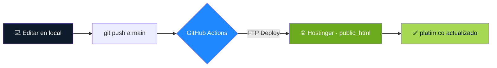

<div align="center">


### Seguridad que inspira confianza

**Sitio web corporativo de PLATIM — Dotaindustria Platim**
Elementos de Protección Personal · Uniformes · Calzado de Seguridad · Colombia

<br/>

[](https://www.platim.co)
[](https://github.com/xentristech/platim/actions)

<br/>


</div>

---

<div align="center">
  
</div>

---

## 🎯 Sobre el proyecto

**PLATIM** es una empresa colombiana que dota a otras empresas con **Elementos de Protección Personal (EPP), uniformes corporativos y calzado de seguridad**. Este repositorio contiene su sitio web corporativo: rápido, accesible, optimizado para buscadores tradicionales **y de IA**, y con despliegue 100% automatizado.

> [!NOTE]
> Un sitio **estático puro** (HTML + CSS + JS, sin frameworks ni build) que aun así incorpora sistema de diseño propio, URLs limpias, datos estructurados, optimización para motores generativos y CI/CD. Demostración de que lo simple, bien hecho, rinde.

<div align="center">

### 👉 [**www.platim.co**](https://www.platim.co) 👈

</div>

---

## ✨ Características

| | Característica | Detalle |
|:--:|---|---|
| 🎨 | **Sistema de diseño propio** | Paleta, tipografía y componentes reutilizables en CSS modular (`variables`, `components`, `responsive`) |
| 📱 | **100% responsive** | Adaptado a móvil, tablet y escritorio con menú móvil accesible |
| 🔗 | **URLs limpias** | Sin `.html` (`/epp`, `/uniformes`…) vía `.htaccess` con redirecciones 301 |
| ⚡ | **Rendimiento** | Lazy loading, `fetchpriority` en el hero, imágenes dimensionadas (cero CLS), caché y GZIP |
| ♿ | **Accesibilidad** | HTML semántico, `aria-labels`, foco visible, `skip links`, `prefers-reduced-motion` |
| 🔍 | **SEO técnico** | Meta tags, Open Graph, canonical, `sitemap.xml`, datos estructurados Schema.org |
| 🤖 | **SEO para IA (AEO/GEO)** | `FAQPage` schema, `llms.txt` y `robots.txt` que habilita ChatGPT, Perplexity y Google AI |
| 💬 | **Cotización por WhatsApp** | El formulario arma el mensaje y abre WhatsApp con un clic |
| 🚀 | **Despliegue automático** | `git push` → publicado en producción en segundos |

---

## 🛠️ Stack tecnológico

<div align="center">

| Frontend | Infraestructura | Automatización |
|:--:|:--:|:--:|
| HTML5 semántico | Hostinger (Apache/LiteSpeed) | GitHub Actions |
| CSS3 (modular, sin frameworks) | Dominio `platim.co` | Deploy por FTP |
| JavaScript vanilla | HTTPS + www forzado | Versionado con Git |
| Google Fonts (Archivo) | Caché y compresión GZIP | — |

</div>

---

## 🚀 Despliegue automático (CI/CD)

Cada cambio en `main` se publica **solo**, sin intervención manual:



> [!TIP]
> Editar el servidor a mano quedó en el pasado. La fuente de verdad es **GitHub**: se edita, se hace `push`, y el sitio se actualiza en producción automáticamente.

---

## 📁 Estructura del proyecto

```
platim/
├── index.html                 # Inicio
├── epp.html                   # Elementos de Protección Personal
├── uniformes.html             # Uniformes y dotaciones
├── calzado-proteccion.html    # Calzado de seguridad
├── politica-privacidad.html   # Legal · Ley 1581 de 2012
├── terminos-condiciones.html  # Legal
├── 404.html                   # Página de error personalizada
├── llms.txt                   # Resumen del sitio para modelos de IA
├── robots.txt · sitemap.xml   # SEO / rastreo
├── .htaccess                  # URLs limpias, caché, seguridad
├── assets/
│   ├── css/                   # variables · style · components · responsive
│   ├── js/                    # main · menu · forms
│   └── images/                # logos · banners · products
└── .github/workflows/         # deploy.yml (CI/CD)
```

---

## 💻 Desarrollo local

<details>
<summary><b>Ver instrucciones</b></summary>

<br/>

Al ser un sitio estático, basta con un servidor local:

```bash
# Clonar el repositorio
git clone https://github.com/xentristech/platim.git
cd platim

# Levantar un servidor local (Python)
python -m http.server 8000

# Abrir en el navegador
# http://localhost:8000
```

> [!IMPORTANT]
> Las URLs limpias (`/epp` sin `.html`) dependen del `.htaccess` de Apache, que **no** interpreta el servidor de Python. En local usa el menú o agrega `.html`. En producción funcionan perfecto.

</details>

---

## 👤 Autor

Desarrollado por **[xentristech](https://github.com/xentristech)** — diseño, desarrollo y automatización.

<div align="center">

[](https://www.platim.co)
[](https://github.com/xentristech)

<br/>

<sub>© 2026 PLATIM — Dotaindustria Platim · Hecho con 💚 en Colombia</sub>

</div>
